# Week_1) Wargame Write-up

### 0. Ubuntu 18.04 LTS installation - WSL2

처음에 VMware를 설치하라는 멘토링의 조언에 약간의 아쉬움이 있었다. VMware는 윈도우 위에 가상으로 돌아가는 시스템이다보니, 마우스 조작도 상대적으로 불편하고 파일 시스템을 조작하는 데에도 불편하기 이를 데 없었으며, 반응속도나 네트워크 제어도 상당히 빡빡했던 것으로 기억한다. 그래서 찾아본 것은 WSL, 즉 Windows Subsystem for Linux였는데, 이게 그 때 당시로는 완전히 독립적인 리눅스 커널을 얹은 것이 아니라는 말을 듣고 실망하였었던 기억이 난다.

그러나, 개발자 프로그램에 마침 WSL2가 업데이트 되며, 완전히 독립된 커널을 사용한다는 말을 듣게 되었고, 과감하게 윈도우 참여 프로그램에 가입하여 2004 업데이트를 받아 WSL2를 설치하였다. 그 과정이 얼마나 복잡하고 힘들었는지는 따로 설명하고 싶은 생각이 안 든다.

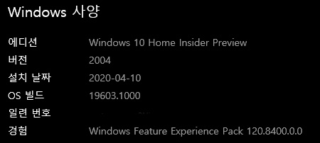

- 윈도우 버전. WSL2를 사용하기 위해 2004버전이다. 그러한 이유로, 필자는 현재 불완전한 시스템으로 인한 알 수 없는 오류에 고통받는 중이다. 특히 한글 입력에서 상당한 에러가 사방팔방에서 나는 중이다.

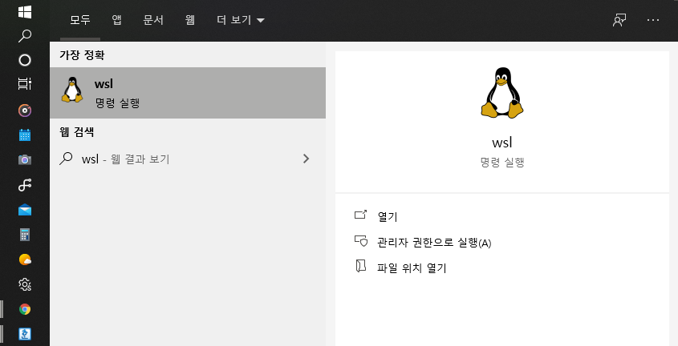

- WSL을 실행하기 위해 명령을 입력한 상태.

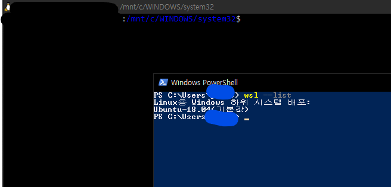

- Powershell과 실제 WSL2 콘솔.

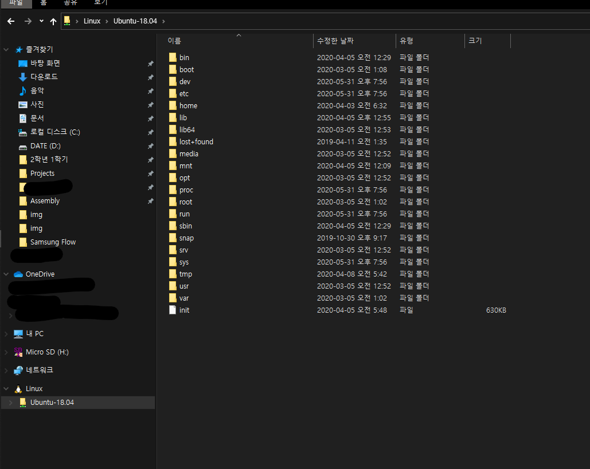

- 무려 윈도우 파일 탐색기에서 리눅스 파일을 조작할 수 있다!!! FileZilla와는 비교가 안되는 편리함을 보여준다.

최근에 Ubuntu 20.04 LTS가 나왔던데. 아....... 음.......

### 1. Overthewire.org - Bandit

##### 1)  Level 0

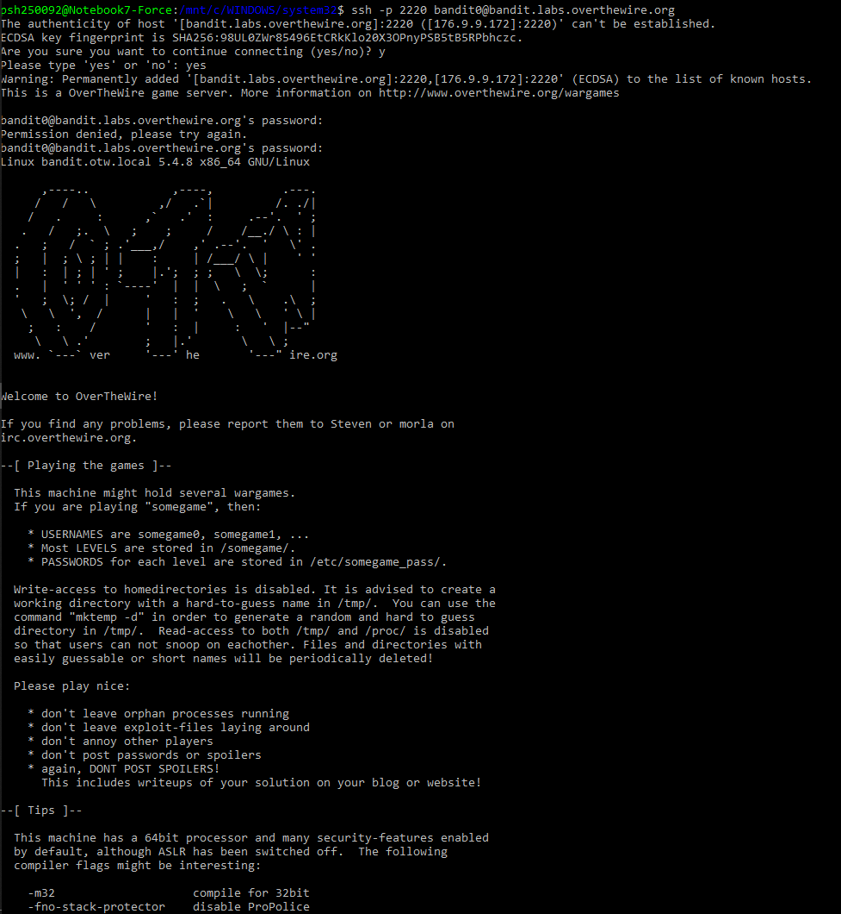

Github에 올라가는 자료라 시스템에 대해 알려질만한건 모두 지우려 했지만, 이젠 귀찮아서 그럴 마음도 사라졌다.

ssh명령어의 -p 플래그를 통해 포트를 설정하고, 비밀번호를 입력하면 이렇게 접속하게 된다.

##### 2) Level 0~1

문제를 해석하여보면, 파일 시스템에 readme 파일에 패스워드를 저장하였으니, 그를 통하여 bandit1로 로그인하라고 나온다.

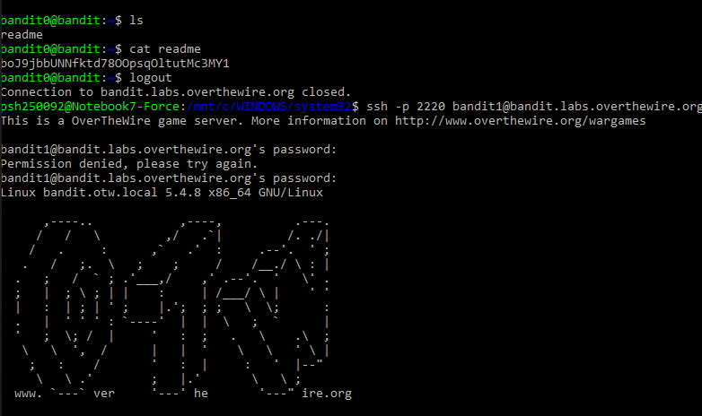

이삭님 멘토링에서 인터넷 프로그래밍 과제와 겹쳐서 혼자서만 JSP로 게시판 사이트를 만든 적이 있었다. 이를 호스팅하기 위해서 AWS EC2 서버를 쓴 적이 있는데, 하필 MySQL7과 Java 12버전을 써서 apt-get으로 설치할 수 없게 되어 하루종일 개고생을 한 적이 있었다.

그 때 신물이 나도록 쓴 것이 ls와 cd, cat, pwd였는데, 이를 까먹을 리가 없지.

##### 3) Level 1~2

2번부터 막혀서 어쩔 수 없이 검색할 수 밖에 없었다. 이 페이스라면 오늘 도 지각인데. 큰일났다.

파일명이 '-' 인..... 파일을 열어서 확인하라고 한다. 누가 이런 파일을 만든다고.

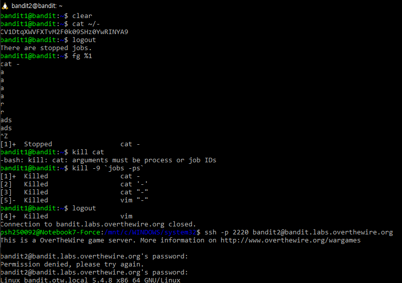

중간에 kill -9 'jobs -ps'의 결과를 보면 알겠지만, -를 먹이면 프로세스들이 옵션이라 인식해서 멈춰버리는 일이 있었던지라 상당히 고생하였다. 모두가 겪는 일이라 생각하고 마음편하게 넘어가려 한다.

결국 정답은 이스케이핑이 아닌 상대경로를 이용하는 방법이었다. 여러 이스케이핑을 시도했었는데, 상당히 화가 난다.

##### 4) Level 2~3

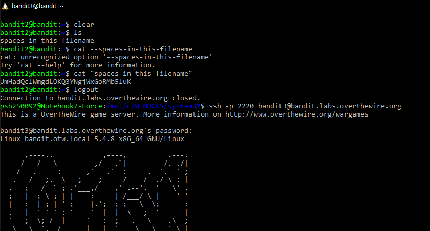

중간에 공백이 들어간 파일이 존재한다. 당연히 이를 그냥 열 수는 없을 것이다. 첫번째 단어인 spaces라는 파일을 열고 뒤는 잘못된 인자로 인식할 것이 뻔하다.

그러니 쌍따옴표로 묶어주자. 이 문제가 전 단계보다 훨씬 쉬운 것 같은 것은 기분 탓일까. 모두가 공백 이스케이핑을 할 줄 알텐데.

간단하게 패스워드를 알아내었으니, 다음 레벨로 넘어가자.

##### 4) Level 3~4

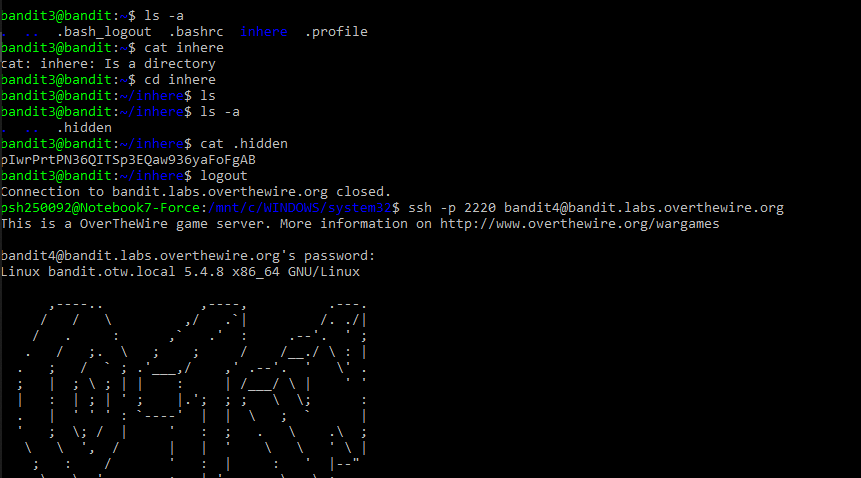

숨겨진 파일을 찾아서 열면 해결되는 문제이다. ls의 -a 옵션을 이용하면 간단하게 찾을 수 있는 문제이다. 딱히 어려울 건 없어보인다.

파일을 열어 패스워드를 확인하고 다음으로 넘어가자.

##### 5) Level 4~5

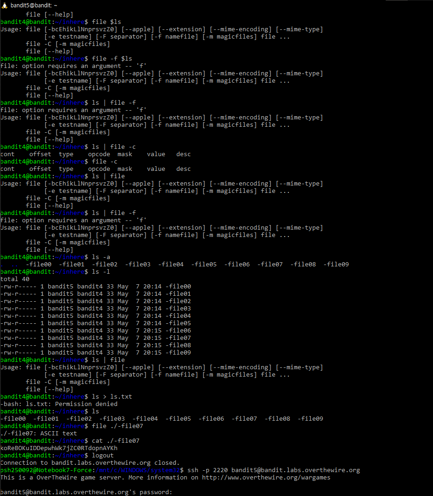

최근에 스터디하면서 배운 것 중 하나는 아예 모르는 것이 있다면, 해답을 찾는 것이 훨씬 빠르고 더 도움이 많이 된다는 것을 알게 되었다.

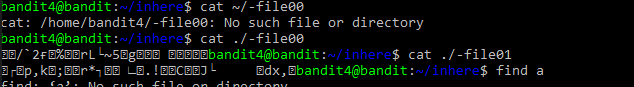

cat를 해보니 모두 다 깨진 문자열이다. ls를 해보니 파일 갯수가 대략 50개가 되던데, 그것을 모두 cat해볼 수 없는 노릇이라 생각하였다.

그래서 bash명령어를 찾아보아 ls | file -f를 시도해보았지만 결국 어떤 방법을 동원해도 안되는건 마찬가지.

결국엔 넷상에서 7번 파일이 답이라는 것을 확인하고서 (이 분도 결국엔 file을 모든 파일에 입력하여보신 분이다.) 문제를 풀었다. for이나 while문을 이용하면 될 것 같기도 하고.

나중에 다시 시도해보고 싶은 문제이다.
